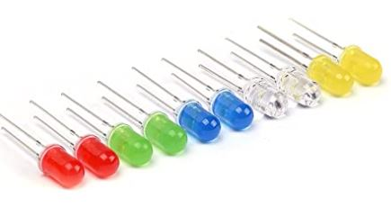
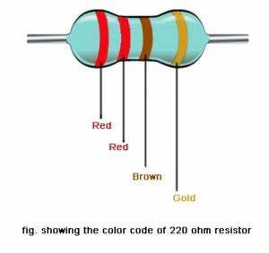
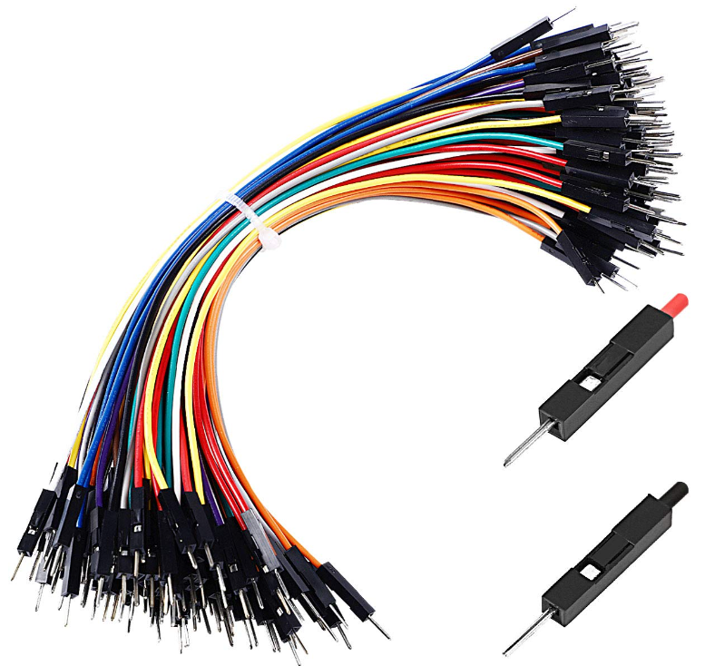
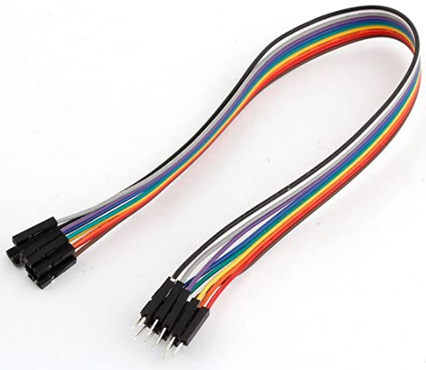

## Introducción - Construyendo con Arduino

¡La electrónica —como los microcontroladores, sensores y todo tipo de circuitos— está a nuestro alrededor! Algunos son muy básicos y proporcionan información de telemetría para los sistemas de tráfico. Otros controlan los semáforos programados con temporizadores integrados.

Hoy trabajaremos en varias actividades para mostrarte algunas de las capacidades de esta plataforma. Empezaremos con proyectos pequeños y sencillos y avanzaremos hacia otros mayores y más complejos. Aprenderás toda la información básica sobre cómo usar la placa controladora Arduino, los sensores y los componentes. Después de realizar cada actividad, siéntete libre de cambiar algunas cosas para ver qué cambia y así obtener una comprensión más profunda.

## Los Componentes

Los componentes que usaremos para el proyecto se muestran a continuación. Asegúrate de tener todos estos componentes antes de comenzar:

`Elegoo` UNO Project Super Starter Kit with Tutorial for Arduino incluye todo el hardware (con excepción de la computadora)

* Componentes principales necesarios para todas las actividades
  * Arduino UNO R3
  * USB A to B cable
  * Windows 10 PC
  * Arduino IDE software (descargar)

* Componentes adicionales necesarios para actividades específicas
  * (5) LEDs (cualquier color)

  * (5) [resistencia de 220 ohm](https://somanytech.com/220-ohm-resistor-color-code)

  * Cables jumper (jumper wires)

  * Cable jumper hembra a macho (female-to-male jumper wire)

  * Panel LCD + resistencia de 5K ohm
  * Batería de 9V (opcional)

## Tabla de contenidos

Tabla de contenidos

{}

