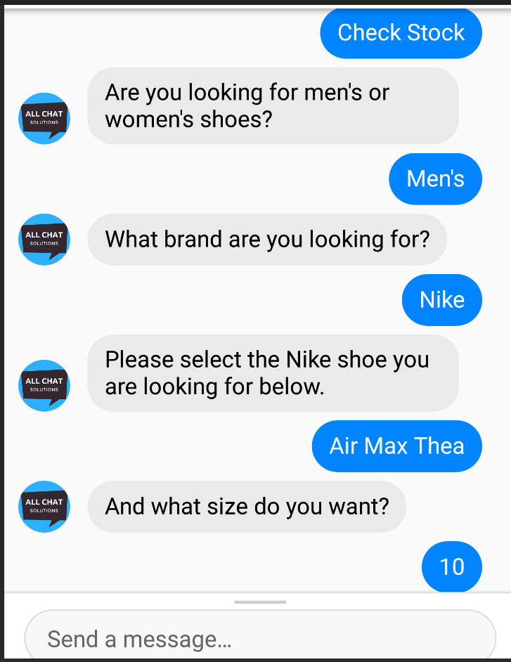

## Introducción
En este taller aprenderás a crear tu propio chatbot. Al final del taller tendrás un chatbot capaz de mantener una conversación simple con el usuario. Aprenderás a usar AIML, un lenguaje para crear chatbots. También aprenderás a usar Pandorabots, una plataforma para alojar chatbots.

Para completar el taller necesitarás una dirección de correo electrónico para registrarte en una cuenta de Pandorabots.

## ¿Qué es un chatbot?
Un chatbot es un programa informático que simula la conversación humana para responder preguntas. 

## Ejemplos de chatbots
Probablemente ya hayas interactuado con un chatbot en tu vida diaria. 

Puedes usar un asistente virtual para poner un recordatorio en tu teléfono o para reproducir una canción en tu altavoz inteligente.

Quizá hayas interactuado con un chatbot para obtener ayuda con un producto o servicio.

Más recientemente, los chatbots se han hecho más conocidos gracias a tecnologías como ChatGPT.

## Historia de los chatbots
Los chatbots existen desde hace mucho tiempo. El primer chatbot se creó en 1966 y se llamó ELIZA. En 1995 se creó un nuevo chatbot llamado ALICE. ALICE fue escrito usando AIML, que es el mismo lenguaje que aprenderemos en este taller.

## Tabla de contenidos

Table of Contents

{}

