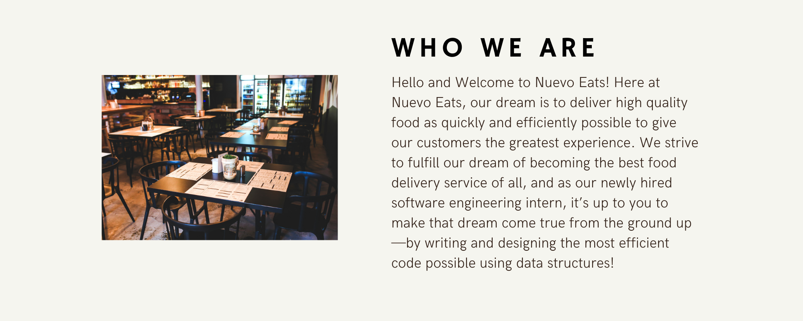

<iframe width="60%" height="600px" src="https://youtube.com/embed/UeK31RyFzN0" frameborder="0" allow="accelerometer; autoplay; clipboard-write; encrypted-media; gyroscope; picture-in-picture" allowfullscreen></iframe>

<!--<link rel="stylesheet" href="../../style.css">-->

## Transformando vidas a través de la comida

En NuevoEats, nuestro objetivo es ayudar a empoderar y elevar las economías y los negocios locales. Empezamos ayudando a los comerciantes: los negocios y restaurantes locales que generan más del 60% de los empleos en cada ciudad. Nuestro sueño es construir una plataforma de logística de última milla, crear un conjunto de servicios para aumentar las ventas de los negocios y desarrollar un programa que conecte a los consumidores con los negocios que los sustentan.

El camino por delante en NuevoEats no será fácil. Por eso estamos buscando personas de todos los orígenes para ayudarnos a resolver problemas aparentemente imposibles a una velocidad vertiginosa. Personas con coraje y determinación, que trabajen duro, rápido e inteligentemente. Personas que no esperan para implementar buenas ideas, que se sienten cómodas con la imperfección pero están decididas a mejorar un 1% cada día. ¿Crees que estás a la altura del desafío? ¡Únete a nosotros!

Temas

{}

;

mantenerlo claro para principiantes. 
Preservar términos técnicos, la sintaxis de código y el formato. Solo traducir los comentarios que expliquen conceptos.
Adaptar referencias culturales de forma apropiada. No traducir la clave del encabezado title; no traducir el HTML de las imágenes.