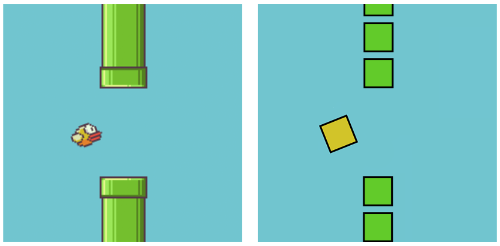
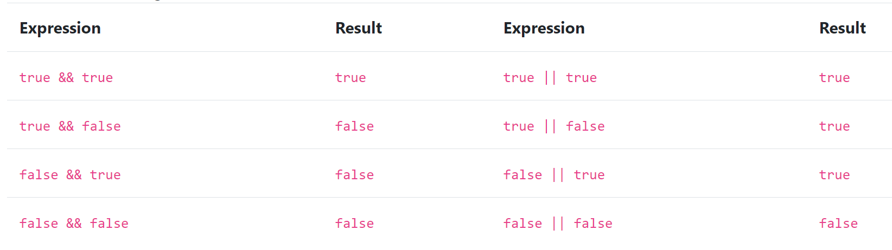

1. **Descarga los archivos requeridos.** <link_here>

La plantilla contiene los siguientes archivos:

- phaser.min.js, el framework Phaser v2.4.3.
- index.html, donde se mostrará el juego.
- main.js, un archivo donde escribiremos todo nuestro código.
- assets/, un directorio con 2 imágenes.
- Activity 1.js
- Activity 2.js
- Activity 3.js

El archivo index.html es la página principal de nuestro juego Flappy Bird, que también usa nuestros dos archivos de Javascript (`.js`). El archivo **phaser.min.js** es el framework de juego que usaremos para crear juegos en el navegador. El otro archivo es **main.js**, que contendrá toda nuestra lógica en Javascript. Los tres archivos de actividad te ayudarán a poner el juego en funcionamiento. Las partes que necesitarás añadir están marcadas con un 🐤🐤🐤.

¡Diviértete!

### Variables

Las variables son simplemente nombres que podemos dar a valores como strings, numbers y Booleans. Usamos variables para almacenar información para que el ordenador pueda hacerle seguimiento. Las variables se crean usando la palabra clave `var` y el nombre de la variable. Luego puedes asignar esa variable a la información que quieres almacenar usando un `=` seguido de la información.

Por ejemplo:

```js
var world = "Hello World";
var x = 88;
var happy = true;
```

También puedes cambiar el valor al que hace referencia un nombre así:

```js
var x = 4;
x = 10;
```

En este ejemplo, la variable `x` se asigna primero a 4 y luego se reasigna a 10.

El código de abajo crea un nuevo objeto Phaser Game y lo almacena en una variable para usar en nuestro juego.

```js
var game = new Phaser.Game(800, 600);
```

## Actividad 1: Usemos tanto Booleans como expresiones Booleanas

### Condicionales

Podemos usar sentencias if para ejecutar una instrucción de código solo si se cumplen ciertas condiciones.

Por ejemplo:

```js
if (isRainingOutside == true) {
  takeUmbrella = true;
}
```

Dentro de los `()` junto a `if`, debes especificar una _expresión Booleana_. Los **Booleans** son declaraciones `true` o `false`. Podemos utilizar esto en nuestra sentencia if. Si la expresión es `true`, el código dentro de `{ }` se ejecuta.

También podemos usar expresiones Booleanas para comprobar si un número está en un rango específico:


También puedes conectar **expresiones Booleanas** entre sí usando los operadores `&&` (AND) y `||` (OR).



`&&` requiere que ambas _expresiones Booleanas_ sean `true`, mientras que `||` solo requiere que una de las dos _expresiones Booleanas_ sea `true`.

Por ejemplo:

```js
// produce true ya que tanto 1 < 100 como 5 != 10 son verdaderos
(1 < 100 &&
  (5 != 10)(
    // produce true porque al menos una de las expresiones resulta ser true
    5 == 5
  )) ||
  10 > 20;
```

#### Abre `Activity 1.js` donde agregarás un condicional que verifique que el pájaro esté entre la parte superior de la pantalla (y = 0) y la parte inferior de la pantalla (y = 490).

## Actividad 2: Ahora añadamos una función que haga que el pájaro salte

### Funciones

Una función se puede pensar como una tarea. Algunas tareas son cortas y simples como sumar `1 + 1` o decir `‘Hello World!’`. Las funciones se pueden usar para ejecutar las mismas tareas varias veces. En este caso, escribiremos una función para hacer que el pájaro salte.

"Saltando" en este juego es simplemente cambiar la posición _y_ del pájaro.

#### Abre `Activity 2.js` donde añadiremos una función llamada `jump`.\*\*

Podemos hacer eso con esta instrucción dentro de la función `jump`:

```js
bird.body.velocity.y = -300;
```

El número se puede ajustar dependiendo de qué tan alto quieras que salte el pájaro. ¡Prueba cambiando el número para ver diferencias en la altura del salto cuando presionas la barra espaciadora!

¡Ahora tu pájaro puede volar por el aire!

## Actividad 3: Añadamos obstáculos

Actualmente, tu pájaro realmente no tiene nada que esquivar en la pantalla, ¡lo cual es un poco demasiado fácil! Podemos usar código para aumentar la dificultad del juego añadiendo objetos que esquivar. Para esto necesitarás usar condicionales y bucles for. Ya cubrimos condicionales, así que ahora revisemos los bucles.

### Bucles

Los bucles se usan para ejecutar un bloque de código múltiples veces. Hay muchos tipos de bucles, pero el que usarás para este proyecto es el bucle for.

Los for loops se formatean así:

```js
for (statement 1; statement 2; statement 3) {
  // bloque de código a ejecutar
}
```

- La Statement 1 se ejecuta una vez antes de correr el código dentro de `{ }`.
- La Statement 2 se usa para definir la condición en la que el bucle dejará de ejecutarse.
- La Statement 3 se ejecuta en cada iteración del bucle.

Por ejemplo

```js
var sum = 0;
for (var i = 0; i < 7; i += 1) {
  sum = sum + 1;
}
```

Después de que este código se ejecute, `sum` será 6. Esto es porque el bucle añadió 1 a esa variable 6 veces. Notarás que creamos una variable llamada `i` en la primera declaración del for. Esta variable se usa para llevar la cuenta de cuánto debe ejecutarse el bucle. En cada pasada por el bucle comprobamos si `i` todavía es menor que 7 y si lo es, ejecutamos el código en los corchetes y luego sumamos 1 a `i`.

Este proceso se repite hasta que `i < 7` sea false.

También podemos usar `i` en el código dentro de los corchetes:

```js
var sum = 0;
for (var i = 0; i < 7; i += 1) {
  sum = i + 1;
}
```

Este código realiza la misma operación, pero usa `i` dentro del bloque.

Puedes ver un for loop en acción aquí: <https://codepen.io/nayomitchell/pen/JgNoQe>! ¡Intenta cambiar los números en las diferentes declaraciones. ¿Puedes averiguar cómo hacer que el bucle cuente hacia abajo?

---

Volviendo a nuestro juego. La pantalla puede acomodar 8 bloques, así que necesitamos un for loop que se ejecute 8 veces. En `Activity 3.js`, tendrás que añadir un for loop alrededor del código que añade un obstáculo en la pantalla.

¡Tenemos otro problema ahora! El juego es demasiado difícil ya que no hay forma para que tu pájaro pase.
¡Añadamos una abertura en la pared de obstáculos para que tu pájaro pueda volar a través!

---

Por encima del código que acabas de editar, hay una variable llamada `hole`. Esta variable es un número entre 1 y 6, que representa dónde debe estar el hueco en la pared.
Lo que queremos hacer es omitir la creación del obstáculo **si** la `i` en el bucle es **la misma** que `hole`. Podemos usar un condicional para saltarnos la creación de un bloque en la pared — ¡dejando un área por la que volar!

Actualmente, la pared se crea añadiendo una tubería a la pantalla cada vez que el bucle se ejecuta. Intenta poner un condicional alrededor de `addOnePipe` en el bucle que haga que `addOnePipe` solo se ejecute cuando `i` no sea el mismo número que `hole`.

Ahora que has realizado estas actividades, ¡deberías tener un juego funcionando! ¡Ve cuántos puntos puedes conseguir!